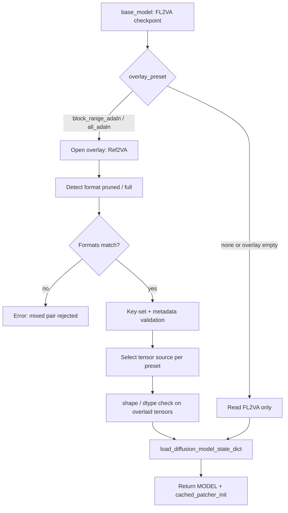

# MiniMax H3 Hybrid Loader Technical Whitepaper

> **Document scope**: This whitepaper describes the design, implementation, and validation of the `MinimaxH3_HybridLoader` plugin for ComfyUI users and video-generation workflow developers. Every conclusion is grounded in local real checkpoints (one `pruned` pair and one `full` pair of int8-convrot files), per-tensor and function-space measurements, and video validation across main recipes, block-range ablations, and a same-seed recheck. No unverified speculation is included.
>
> **Core conclusions**: FL2VA already contains a complete reference-conditioning path, and reference capability is carried by the conditioning path shared by both checkpoints — not by Ref2VA's retrained AdaLN modulators. Hybrid loading is therefore best understood as "a lossless FL2VA base plus validated modulation fine-tuning." Production usage converges to three presets: `none` (lossless baseline), `block_range_adaln` 45–49 (production trade-off, default), and `all_adaln` (experimental).

## Abstract

ComfyUI is a mainstream platform for local image and video generation; MiniMax H3 ships as two checkpoint variants, FL2VA and Ref2VA, and a single int8-convrot checkpoint is already 19.53 GB (`pruned`) to 31.7 GB (`full`), making dual-model loads impractical on typical 32 GB systems and forcing users to choose between FL2VA quality and Ref2VA reference capability. Community hybrid-loading approaches are based on weight-space analysis and assume that reference capability is carried by Ref2VA's retrained AdaLN modulators, so overlaying those weights should transfer the capability; however, that assumption was never validated along the real forward path or through video quality inspection, and the proposed 25–49 overlay range produces structural artifacts in practice. This whitepaper proves that reference capability is provided by the conditioning path shared by both checkpoints, and that FL2VA already possesses a complete reference path; based on this, we design and implement `MinimaxH3_HybridLoader`, replacing "overlaying weights to buy reference capability" with "a lossless FL2VA base plus validated modulation fine-tuning" for ComfyUI MiniMax H3 video workflows running on local int8-convrot checkpoints under DynamicVRAM/AIMDO. Function-space measurement flips the pruned pair's AdaLN cosine from −0.748 in weight space to 0.9976 in function space; main-recipe (P0–P5/F0–F5) and block-range ablation video validation converge production usage to `none`, `block_range_adaln` (45–49), and `all_adaln`, while `ref2va_exact` — which also overlays output heads and the time embedder — is excluded because it causes structural degradation. The plugin is open source under GPL-3.0-or-later, has no extra Python dependencies, and preserves ComfyUI's native file-backed loading and multi-GPU reload paths.

## 1. Introduction

### 1.1 Problem

MiniMax H3 is one of the widely used models in current video-generation workflows. The ComfyUI community typically consumes it through two checkpoint variants: FL2VA, which emphasizes stable image-generation quality, and Ref2VA, which provides reference-driven shot organization. Real checkpoints are large — a single `pruned` checkpoint is about 19.53 GB and a single `full` checkpoint about 31.7 GB — so holding two models in memory simultaneously, or loading both fully into RAM, is impractical on common 32 GB systems. Users therefore face a real either/or: load FL2VA for quality but forgo reference capability, or load Ref2VA for reference capability while accepting softer image quality and higher memory pressure.

An existing community hybrid-loading attempt (scottmudge's `ComfyUI_MinimaxH3HybridLoader`) overlays Ref2VA's AdaLN modulation weights onto an FL2VA base, aiming to "keep FL2VA quality while gaining Ref2VA's reference capability." However, that approach is based on weight-space analysis, its overlay range (25–49) was never validated with video output, and the author explicitly noted that all configurations require empirical validation.

### 1.2 Gaps

Existing approaches fall short in three verifiable ways:

**G1: The origin of reference capability is not established empirically.** Existing analysis assumes reference capability is carried by Ref2VA's retrained AdaLN modulators, but the evidence is only indirect weight-space evidence; weight cosine values of −0.70~−0.81 are read as "completely different," while behavior along the real forward path was never measured.

**G2: Validation stops at weight space; function-space and video evidence are missing.** Weight cosine distance is not behavioral distance. Under `pruned` format's 8-dimensional curve-basis reparameterization, weight differences largely fall in directions orthogonal to the input; weight metrics alone cannot tell whether an overlay is effective, let alone safe.

**G3: Loaders are not format-aware, and the block-range policy is applied across formats.** `pruned` (`adaln_t_table`) and `full` (`time_embedder.*`) have different difference distributions: on the pruned pair the significant differences are in AdaLN (nearly equivalent in function space), while on the full pair they are in `time_embedder` and the output heads. The same range policy cannot be applied safely to both formats, and mixing formats directly produces a semantically wrong model.

### 1.3 Thesis

The thesis of this whitepaper is: **reference capability is provided by the conditioning path shared by FL2VA and Ref2VA, and FL2VA already possesses a complete reference path; therefore, for ComfyUI MiniMax H3 video workflows, the best hybrid-loading strategy is "a lossless FL2VA base plus validated modulation fine-tuning," not "overlaying weights to buy reference capability."**

### 1.4 Contributions

This whitepaper makes the following contributions, each mapped to the section that supports it:

1. **Analysis**: Function-space measurement proves that "weight cosine distance ≠ behavioral distance": the pruned pair's AdaLN weight cosine of −0.748 flips to an output cosine of 0.9976 along the real time path (§3).
2. **Analysis**: Five closing lines of evidence — structural homology, modulation equivalence, identical runtime paths, video evidence, and elimination — prove that the main carrier of reference capability is the shared conditioning path (§4).
3. **Design**: Three presets (`none` / `block_range_adaln` / `all_adaln`), format-aware validation, and same-source quantization-sibling rules; every major design decision documents the rejected alternatives (§5).
4. **System**: A working implementation, `MinimaxH3_HybridLoader` (300 lines of Python, no extra dependencies), that preserves ComfyUI's DynamicVRAM/AIMDO file-backed loading, RAM protection, and multi-GPU reload (§6).
5. **Evaluation**: Main recipes, block-range ablations, a same-seed recheck, and memory measurements on both the pruned and full formats converge to reproducible production presets (§7).

### 1.5 Roadmap

§2 provides the background needed to follow the paper and the production observations that drive the design; §3 reproduces the community analysis and reports the function-space discrepancy; §4 proves where reference capability lives; §5 describes the design decisions and their alternatives; §6 describes the implementation; §7 presents the evaluation evidence; §8 compares with related work; §9 concludes and outlines future work.

## 2. Background and Motivation

### 2.1 Technical Background

**FL2VA and Ref2VA.** MiniMax H3 ships two checkpoint variants: FL2VA, focused on generation quality, and Ref2VA, focused on reference-conditioned generation. Their structures are nearly identical; differences are concentrated in a small set of tensor groups.

**AdaLN reparameterization.** The `pruned` format reparameterizes AdaLN with an 8-dimensional curve basis, `adaln_t_table` (F32 `[1025, 8]`), with modulation weights of F16 `[96768, 8]`; the `full` format uses `time_embedder.*` instead, with modulation weights of I8 `[96768, 2688]` plus `weight_scale`. The AdaLN output row layout is `96768 = 6 (expand) × 3 (modality) × 5376`, ordered modality0 (video/cond) → modality1 (text) → modality2 (audio), with 32256 rows per modality.

**The real forward path.** In the `pruned` format, the actual modulation computation is `W @ t_table[t]` (weights times the time curve basis), not a direct product of a 2688-dim modulation vector with the weights. Consequently, weight cosine reflects only directional relationships in the 8-dim input space, not the actual modulation output.

**ComfyUI's reference-conditioning path.** ComfyUI's core `MiniMaxH3ReferenceToVideo` and `PackedLayout` use one runtime path for all H3 checkpoints; there is no FL2VA/Ref2VA variant detection. Any H3 checkpoint receives reference conditions and runs the full reference path.

**File-backed loading.** ComfyUI's DynamicVRAM/AIMDO path reads tensors on demand from files; when it is disabled, this plugin falls back to streaming `safe_open` reads that release tensors as soon as they are consumed.

### 2.2 Production Observations

The following observations all come from float64-rechecked measurements on four local real checkpoints (one pruned pair and one full pair):

**O1: Weight-space and function-space conclusions are opposite.** On the pruned pair, `blocks.*.adaln_proj.linear.weight` has a mean weight cosine of −0.748 (superficially "completely different"), but when modulation outputs are computed along the real time path (257 uniformly sampled time steps), the mean output cosine across all 50 blocks is 0.9976 and the minimum is 0.9956. → Design must rely on the real forward path, not weight metrics.

**O2: The pruned and full pairs have different difference distributions.** On the pruned pair, the significant differences are in AdaLN (nearly equivalent in function space); on the full pair, the AdaLN weights themselves are nearly identical (cosine 0.9993–0.9998), and the real differences are in `time_embedder.proj_out` (relative mean 0.6332), the output heads, and early-to-middle block modulation rows. → A loader must be format-aware; one range policy cannot be applied across formats.

**O3: Reference-path components are identical tensor-by-tensor.** `condition_proj` cosine ≥ 0.9998, `token_refiner.blocks` ≥ 0.9994, `adaln_t_table` 0.9998, and `video_patch_proj`/`audio_patch_proj` ≥ 0.9995. → FL2VA already has the complete reference-processing structure.

**O4: Full-range overlay is "sharpest" but accumulates artifacts.** Main-recipe and ablation videos show that full 25–49 overlay gives the highest sharpness but accumulates structural anomalies; 45–49 shows no collapse and no extra anomalous objects on either the P or F side. → The production range must be converged by video validation, not ranked by weight distance.

## 3. Reproduction and Function-Space Analysis

### 3.1 Baseline: scottmudge's Weight-Space Findings

scottmudge's per-tensor analysis of the pruned checkpoints reports: about 97% of parameters have cosine ≥ 0.9997; differences are concentrated in each block's `adaln_proj.linear.*` (cosine −0.70~−0.81, relMean 0.73–0.77) and `final_layer.adaln_proj` (cosine −0.83); output-head differences are moderate; and the reference-token components (`token_refiner`/`condition_proj`) are nearly identical (cosine ≥ 0.9994). The proposed hybrid strategy is to overlay Ref2VA's AdaLN modulation weights, with the explicit caveat that all configurations require empirical validation.

### 3.2 Weight-Space Reproduction (Pruned Pair)

We independently measured the same pruned pair with streaming reads (per-key reads with immediate release, peak memory ~1.5 GB, all values float64-rechecked):

| Metric (pruned pair) | scottmudge reported | Our measurement | Agreement |
|---|---:|---:|---|
| `blocks.*.adaln_proj.linear.weight` cosine | −0.70 ~ −0.81 | −0.70 ~ −0.81 (mean −0.748 over 50 blocks) | Match |
| `blocks.*.adaln_proj` relMean | 0.73 ~ 0.77 | 1.45 ~ 1.50 (weight space) | Same magnitude |
| `final_layer.adaln_proj.linear.weight` cosine | −0.83 | −0.8302 | Match |
| `adaln_t_table` cosine | 0.9998 | 0.9998 | Match |
| `final_layer.audio_out.weight` relMean | 0.199 | 0.1992 | Match |
| `final_layer.video_out.weight` relMean | 0.072 | 0.0720 | Match |

The weight-space data reproduces completely, confirming that the original analysis is reliable within weight space; its limitation is that it never enters function space.

### 3.3 Function-Space Methodology

For the pruned pair, modulation outputs are computed along the model's real forward path, `W @ t_table[t]`: 257 uniformly sampled time steps, per-block and per-modality cosine between FL2VA and Ref2VA actual modulation outputs; the full pair is measured per-tensor over `time_embedder` and the output heads. All values are float64-rechecked.

### 3.4 Function-Space Results (Pruned Pair)

| Metric (pruned pair, function space) | Value |
|---|---:|
| Mean output cosine over 50 blocks | 0.9976 |
| Minimum output cosine | 0.9956 |
| Mean cosine, video modality | 0.9970 |
| Mean cosine, text modality | 0.9974 |
| Mean cosine, audio modality | 0.9971 |

**Figure 3-1.** Per-block AdaLN cosine over the 50 blocks of the pruned pair: weight-space mean −0.748 (blue) vs. function-space mean 0.9976 (red); weight cosine distance is not behavioral distance.

**Conclusion**: The weight-space mean cosine of −0.748 and the function-space mean cosine of 0.9976 differ by about 1.75. Weight differences largely fall orthogonal to the input; along the real time path, the two variants' actual modulation outputs have cosine ≥ 0.9956 (mean 0.9976). Therefore, "overlaying Ref2VA's AdaLN weights transfers reference capability" changes only about 0.4% of the modulation output on the pruned int8-convrot pair — clearly inconsistent with the "capability switch" expectation.

### 3.5 Additional Measurements on the Full Pair

The full pair's differences are not in the AdaLN weights (cosine 0.9993–0.9998, relative difference 2.1%–4.5%), but in:

| Tensor | Cosine | Relative mean |
|---|---:|---:|
| `time_embedder.proj_out.weight` | 0.9981 | 0.6332 |
| `final_layer.audio_out.weight` | 0.9970 | 0.1992 |
| `final_layer.video_out.weight` | 0.9987 | 0.0720 |
| `final_layer.adaln_proj.linear.weight` | 0.9965 | 0.0757 |

**Figure 3-2.** Relative mean differences of key non-block tensors on the full pair: `time_embedder.proj_out.weight` (0.633) dominates, while the AdaLN weights themselves differ very little.

The original hybrid loader never overlays `time_embedder`, so on the full format it never touches the main differences; because the difference distribution differs from pruned, the range policy must be validated per format.

### 3.6 Five Conclusions

1. Weight cosine distance is not behavioral distance; function outputs must be computed along the real time path (demonstrated by the pruned pair's −0.748 → 0.9976 flip);
2. Pruned and full have different difference distributions; one range policy cannot be applied to both;
3. Output heads and the time embedder are high-risk regions and must not be overlaid unconditionally;
4. Reference capability is provided by the conditioning path, not determined by a few weights;
5. Production presets must be converged by video validation, not ranked by weight distance.

## 4. The Carrier of Reference Capability: The Shared Conditioning Path

### 4.1 Proof Chain

**Proof 1: Structural homology.** The reference-token components are tensor-by-tensor identical between the two checkpoints: `condition_proj` cosine 0.9998, `token_refiner.blocks` ≥ 0.9994, `adaln_t_table` 0.9998, `video_patch_proj`/`audio_patch_proj` ≥ 0.9995 (§3.4). The structure of the reference path (reference-condition projection → token refinement → residual-stream modulation) is fully homologous in FL2VA and Ref2VA; there is no possibility that "FL2VA lacks the reference-processing components."

**Proof 2: Modulation equivalence.** The only significantly different tensor group between the two checkpoints is AdaLN, and it is nearly equivalent in function space. Pruned pair: weight-space mean cosine −0.748, but along the real time path the mean function-space cosine over 50 blocks is 0.9976 with a minimum of 0.9956; overlaying AdaLN changes only ~0.4% of the modulation output (§3.4). Full pair: the AdaLN weights themselves have cosine 0.9993–0.9998, an even smaller difference (§3.5). If reference capability were unique to Ref2VA, it would have to be carried by some tensor group; the only "significantly different" candidate group is nearly equivalent in function space and cannot carry that capability.

**Proof 3: Identical runtime path.** ComfyUI's `MiniMaxH3ReferenceToVideo` and `PackedLayout` treat every H3 checkpoint identically; there is no FL2VA/Ref2VA variant detection. FL2VA receives reference conditions and runs the full reference path directly.

**Proof 4: Video evidence.** P0/F0 (`overlay_preset = none`, empty overlay_model) is pure FL2VA plus the reference-condition node, and is the most stable lossless baseline in the video tests; adding only modulation fine-tuning (`block_range_adaln` 45–49, `all_adaln`) already yields reference-driven shot organization, while overlaying final AdaLN, the time embedder, or the output heads on top of `all_adaln` (P4/P5/F4/F5, `ref2va_exact`) causes structural degradation (§7.2, §5.3). This shows that the source of reference capability is the shared conditioning path, not Ref2VA's overlaid tensors.

**Proof 5: Elimination.** If reference capability were unique to Ref2VA, its carrier could only be among the significantly different tensors: the pruned pair's AdaLN (nearly equivalent in function space) or the full pair's `time_embedder`/output heads (which structurally degrade when overlaid onto FL2VA). Output heads and the time embedder are experimentally shown to degrade when overlaid, so they cannot be the "reference-capability switch"; the only remaining candidate, AdaLN, is equivalent in function space. Therefore no "Ref2VA-only, FL2VA-missing" carrier of reference capability exists.

### 4.2 Evidence Summary

| Evidence | Key data | Conclusion |
|---|---|---|
| Structural homology | `condition_proj` 0.9998, `token_refiner` ≥ 0.9994, `adaln_t_table` 0.9998 | FL2VA has the complete reference-processing structure |
| Modulation equivalence (pruned) | weight −0.748 → function 0.9976 (min 0.9956) | Overlaying AdaLN changes ~0.4% of modulation output |
| Modulation equivalence (full) | AdaLN weight 0.9993–0.9998 | Differences are not in AdaLN |
| Runtime path | `MiniMaxH3ReferenceToVideo`/`PackedLayout` have no conditional branch | FL2VA runs the full reference path directly |
| Video evidence | P0/F0 pure-FL2VA baseline holds; `ref2va_exact` structurally degrades | Reference capability comes from the shared path; overlay is only fine-tuning |

### 4.3 Design Implications

"FL2VA already has reference capability" directly determines this plugin's orientation: FL2VA is the lossless base, overlaid tensors are an optional modulation fine-tune; "gaining reference capability" is not the motive for overlaying weights — instead, the quality/stability/reference-intensity trade-off is expressed through three presets.

## 5. Design

### 5.1 Architecture Overview

`MinimaxH3_HybridLoader` is a single-node loader with inputs `base_model` (FL2VA), `overlay_model` (optional Ref2VA), and `overlay_preset`, producing a ComfyUI `MODEL`. Its data flow is:

Typical request flow: the node filters FL2VA/Ref2VA candidates by filename and provides defaults → opens the base checkpoint (in `none` mode the overlay is never opened) → in hybrid mode opens the overlay and performs format detection and consistency checks → decides per key whether to take base or overlay per the preset → builds the `MODEL` through ComfyUI's standard path, registering a `cached_patcher_init` factory so multi-GPU deepclone and non-dynamic delegates can rebuild from disk.

### 5.2 Preset Semantics

| Preset | Overlay content | Role |
|---|---|---|
| `none` | Pure FL2VA; the overlay checkpoint is never opened | Lossless baseline; memory/VRAM/performance identical to a single model |
| `block_range_adaln` (default) | Fixed overlay of `adaln_proj` for blocks 45–49 | Production trade-off between quality and stability |
| `all_adaln` | All block AdaLN + final AdaLN + format-corresponding time embedding (`adaln_t_table` for pruned, `time_embedder.*` for full) | Reference-first experimental recipe |

The output heads (`video_out`/`audio_out`, etc.) always remain FL2VA under every preset.

### 5.3 Key Design Decisions and Alternatives

**D1: The default range is fixed at 45–49, not 39–44, 25–49, or a user-adjustable range.** In the ablation measurements, the P side prefers 39–44 and the F side prefers 45–49; full 25–49 is sharpest but accumulates artifacts. To unify behavior across formats, the production default takes the safer later interval among the two first choices: 45–49.
*Alternative 1*: expose `block_range_start/end` so users can choose — rejected: ranges already shown to produce artifacts (25–31, 32–38, 25–49) should not be everyday options.
*Alternative 2*: default to 39–44 — rejected: it is the P-side first choice but only a conservative second choice on the F side; it cannot unify both formats.

**D2: Output heads and the time embedder are never overlaid.** `ref2va_exact` (full AdaLN + final AdaLN + time embedder + output heads) shows structural degradation in video tests (products, hands, and backgrounds compressed into vertical strips or broken blocks).
*Alternative*: include output heads in the overlay — rejected: it structurally degrades the video; it is retained only as a "parameter/function-behavior reproduction" reference, never as a production default.

**D3: Quantization sibling keys stay same-source with their owning weight.** `.comfy_quant`, `weight_scale`, `pre_quant_scale`, and similar companion keys always come from the same checkpoint as the weight they belong to.
*Alternative*: always take quantization metadata from the base — rejected: scales would not match overlay weights and would break dequantization.

**D4: Strict format detection; mixed pruned/full pairs are rejected.** Detection rule: presence of `adaln_t_table` → pruned; presence of `time_embedder.*` → full; exactly one of the two must hold, otherwise the loader errors; a format mismatch between base and overlay is rejected outright.
*Alternative*: allow mixed formats — rejected: the two layouts use different modulation computation paths, and mixing produces a semantically wrong model.

**D5: ComfyUI's file-backed loading path (DynamicVRAM/AIMDO) is preserved.** In hybrid mode the loader prefers ComfyUI's file-backed path; when AIMDO is off, it uses streaming `safe_open` with per-key reads and immediate release.
*Alternative*: fully load both state dicts into RAM — rejected: about 39 GB for the pruned pair and 63 GB for the full pair, exceeding 32 GB system memory.

**D6: System RAM protection.** When AIMDO is off and hybrid loading is requested, the loader requires available RAM ≥ base checkpoint size + 1 GiB, otherwise it errors and suggests using the pruned pair or enabling DynamicVRAM.
*Alternative*: load without a guard — rejected: low memory crashes mid-load and is hard to diagnose.

**D7: A `cached_patcher_init` factory is registered.** The returned patcher carries the `(base_path, overlay_path, preset)` factory arguments so multi-GPU deepclone and non-dynamic delegates can rebuild the model from disk.
*Alternative*: return a plain patcher — rejected: deepclone/non-dynamic delegates could not correctly rebuild a hybrid-loaded model.

### 5.4 Design Decision Summary

| Decision | Choice | Alternative | Why rejected |
|---|---|---|---|
| Default range | 45–49 | 39–44 / 25–49 / adjustable | Unifies formats; 25–49 accumulates artifacts; adjustable invites invalid ranges |
| Output heads | never overlaid | overlay heads | structural video degradation |
| Quantization siblings | same source as weight | always from base | scale/weight mismatch |
| Format mixing | rejected | allowed | semantically wrong layout |
| Memory path | file-backed / streaming | full in-RAM load | infeasible on 32 GB |
| RAM guard | base + 1 GiB | no guard | crashes mid-load, hard to diagnose |
| Multi-GPU reload | `cached_patcher_init` | no factory | deepclone cannot rebuild |

## 6. Implementation

### 6.1 Code Shape

The plugin is implemented in a single file, `hybridloader.py` (300 lines of Python, GPL-3.0-or-later). Its only dependencies are ComfyUI's bundled libraries (`comfy.sd`, `comfy.model_management`, `comfy.memory_management`, `comfy.utils`, `folder_paths`) plus `safetensors` and `torch`; there are no extra Python dependencies. The node is registered in `__init__.py` as `MinimaxH3_HybridLoader` under the category `ANe5s Nodes` (displayed as `ANe5s节点` in the Chinese UI), with `locales/en` and `locales/zh` node strings.

### 6.2 Key Engineering Decisions

- **Streaming reads**: on the non-AIMDO path, `safe_open` exposes a tensor source and tensors are fetched with `get_tensor` on demand and released immediately; on the AIMDO path, `load_torch_file`'s file-backed semantics are reused.
- **Key-set validation**: non-quantization keys of base and overlay must match exactly; quantization sibling keys may exist on either side (and are included only when their owning weight is selected).
- **Tensor-level validation**: an overlaid overlay tensor is checked for shape/dtype consistency against the same key in the base, and errors on mismatch.
- **Metadata validation**: conflicting key metadata (`format`, `modelspec.architecture`, `model_type`) rejects the load.
- **Actionable errors**: format-detection failures, mixed formats, and insufficient RAM all produce errors with concrete suggestions (use the pruned pair, enable DynamicVRAM, etc.).

### 6.3 Test Coverage

`tests/test_hybridloader.py` (unit tests over temporary safetensors files) covers: single-model return under `none`; `block_range_adaln` default 45–49 boundaries; quantization siblings following their owning weight; `all_adaln` including `adaln_t_table`/`time_embedder.*` on pruned/full respectively; mixed-format rejection; shape mismatch rejection for selected tensors; and the cached-factory parameters plus regression items.

## 7. Evaluation

### 7.1 Experimental Setup

**Testbed**: local single-machine ComfyUI deployment with 32 GB system memory; GPU model, driver, and ComfyUI version are recorded in the test-environment log (this whitepaper does not assume a specific GPU).
**Checkpoints**: four local real int8-convrot checkpoints (one pruned pair and one full pair); a single pruned checkpoint is about 19.53 GB and a single full checkpoint about 31.7 GB.
**Baselines**: pure FL2VA (P0/F0, `none`), pure Ref2VA (P1/F1, standard load), and scottmudge's weight-space analysis.
**Workloads**: main recipes P0–P5 / F0–F5; block-range ablations 25–31, 32–38, 39–44, 45–49, 25–49; F3 same-seed recheck.
**Metrics**: weight-space cosine/relative mean (float64), function-space output cosine, sharpness proxy metrics (overall/face/product), and human quality inspection (structural collapse, anomalous objects/liquids, facial continuity, shot organization).
**Generation configuration**: fixed seed, 1344×768, 124 frames (~5 s), the same sampler/steps/CFG, `MiniMaxH3SigmaShift` (12/3), and the same reference material and prompt; the F3 recheck uses 704×288, 24 fps, ~15.08 s.

The evaluation follows the hypothesis–result–conclusion rule: each experiment opens with a hypothesis, presents evidence-backed results, and closes with a conclusion tied to a design decision; figure captions also carry evidence.

### 7.2 End-to-End: Main Recipes (P0–P5 / F0–F5)

**Hypothesis**: pure FL2VA loading (P0/F0) should hold as the lossless baseline; the closer the overlay approaches Ref2VA (P5/F5 `ref2va_exact`), the closer the reference behavior should approach pure Ref2VA, with higher quality/stability risk.

| Recipe | Observed result |
|---|---|
| P0 / F0 | Most stable; the lossless FL2VA baseline holds |
| P1 / F1 | Stronger reference logic but softer image quality; retired |
| P2 / F2 | Sharper but with local anomalies (P2: green bottle / semi-transparent vertical structures over the face around 11.5–11.9 s; F2: unnatural mouth/smile across adjacent frames); experimental QC only |
| P3 | Best overall in the pruned main-recipe batch: noticeably stronger reference shot organization while retaining FL2VA texture, only slightly softer than P2; retained after human QC |
| F3 | Full-format `all_adaln`: the same-seed recheck keeps products, people, and shot organization continuously identifiable, with more aggressive local composition, edge highlights, and reference driving; wider coverage and higher risk, so experimental human QC only |
| P4 / P5 / F4 / F5 | Structural degradation early in the timeline (products, hands, and backgrounds compressed into vertical strips or broken blocks); retired |

**Conclusion**: reference capability does not increase monotonically with overlay scope; overlaying final AdaLN, the time embedder, and the output heads causes structural degradation, confirming these tensors are not a "reference-capability switch." P3 (pruned, `all_adaln`) is retained as the human-checked reference-first recipe; F3 (full, `all_adaln`) is usable but remains an experimental recipe requiring human QC, so the pruned result must not be generalized to full.

Figures 7-1 to 7-6 (P0–P5, 8.0–12.0 s window, 4 fps, 16-frame grid):

Figures 7-7 to 7-12 (F0–F5, same extraction window):

Figures 7-13 to 7-16 (P4/P5/F4/F5 full 0–15 s timelines, 4/3 fps, 20 frames, to capture early structural degradation):

### 7.3 Ablation: Block-Range Policy

**Hypothesis**: later blocks (45–49) should provide sharpness gains while keeping structure stable; full 25–49 should accumulate artifacts because its coverage is too wide.

#### P (pruned) block-range ablation

| Range | Observed result |
|---|---|
| `25–31` | Locally sharper faces, but vertical stripe / local structural instability in the later part; not recommended |
| `32–38` | Sharper product details, but softer faces and early/late structural fluctuation; not recommended |
| `39–44` | Small sharpness gains for products, droplets, and faces; no obvious extra objects/liquid spill/structural breaks in key segments; P-side first choice |
| `45–49` | More creative; no collapse or extra anomalous objects/liquids from a human perspective; retained |
| `25–49` | Sharpest but accumulates artifacts; visible vertical/semi-transparent structure interference in the later face segment; experimental comparison only |

Sharpness proxy (P `39–44` vs P BASE): overall ~95.5 → 98.5, face ~58.0 → 61.7, product ~152.0 → 154.0.

#### F (full) block-range ablation

| Range | Observed result |
|---|---|
| `25–31` | Clearer product details, small face gains; usable when products matter most |
| `32–38` | Obvious hand/product structural fluctuation early; not recommended |
| `39–44` | Moderate sharpness gains; cleaner faces and products; conservative second choice |
| `45–49` | Largest sharpness gain; no F2-style mouth/smile jumps or extra objects in this sample; F-side first choice |

Sharpness proxy (F `45–49` vs F BASE): overall ~92.9 → 110.7, face ~58.2 → 74.0, product ~145.6 → 164.3.

**Figure 7-32.** Clarity proxy metrics (overall/face/product): gains of P `39–44` and F `45–49` over their respective FL2VA baselines (data from the sharpness-proxy measurements).

**Conclusion**: the P side prefers 39–44 and the F side prefers 45–49; to unify behavior across formats, the production default takes the safer later interval, 45–49. Deprecated ranges (anomalous samples of 25–31/32–38/39–44 and full 25–49) are judged by human QC: some shots add anomalous objects/liquids or show structural fluctuation.

Figures 7-17 to 7-22 (P ablations BASE/25–31/32–38/39–44/45–49/25–49) and Figures 7-23 to 7-27 (F ablations BASE/25–31/32–38/39–44/45–49):

### 7.4 Supplementary Recheck: F3 Same Seed

**Hypothesis**: the `full`-format `all_adaln` (F3) should not be assumed from the pruned P3 result; a same-seed comparison should isolate the recipe's contribution to composition and stability.

**Result**: with a fixed seed of `818992819964440` and workflow `cff0ebf7-5d4f-49fc-8957-507c410e7bff`, `F3_00001_.mp4` (704×288, 24 fps, ~15.08 s) was compared against same-seed outputs that switch only the recipe (`none`, `block_range_adaln`): product placement, lid opening, droplet, human-applying, and final hero shot are all generated completely; product outlines, hand-contact relations, faces, and shot organization remain continuously identifiable; no early-window large-scale vertical contraction or severe structural collapse like F4/F5 is observed; F3 is more aggressive in local composition, edge highlights, and product/person reference driving than 45–49, but its wider coverage carries higher risk.

**Conclusion**: F3 is usable but is an experimental non-pruned full-AdaLN recipe that requires human QC; it is not the default production mode. The pruned P3 result must not be generalized to `full`-format `all_adaln`.

Figure 7-28 (F3 keyframes) and Figures 7-29 to 7-31 (F3 / none / 45–49 same-frame comparisons):

### 7.5 Function-Space and Static Per-Block Analysis

**Hypothesis**: if 45–49's benefit came from "the most different range," the pruned pair's per-block relative differences should be largest in 25–49; otherwise sharpness comes from another mechanism.

**Result**: the pruned pair's actual AdaLN output differences are not largest in 25–49 — the `0–24` mean relative difference is about 9.4%, `25–49` is about 7.5%, and the maximum is concentrated in `7–17` (about 9.3%) (measured means from `docs/assets/h3_pruned_function_space_rel.json`).

**Figure 7-33.** Per-block function-space output relative differences on the pruned pair (video/text/audio) with range means: 0–24 ≈ 9.4%, 25–49 ≈ 7.5%, with the maximum concentrated in 7–17 (orange shading); the later blocks are not the most different.

**Conclusion**: later blocks' sharpness more likely comes from stage-wise amplification of the denoising trajectory rather than from the largest numeric differences; the same later-stage amplification likely explains the artifacts. This further shows that the range policy cannot be derived from static weights and can only be converged through video validation.

### 7.6 Memory and Scalability

**Hypothesis**: hybrid loading should keep single-model memory behavior and should not degrade significantly with checkpoint format (pruned/full).

**Result**: the streaming path (per-key reads with immediate release) peaks at about 1.5 GB and fits in 32 GB system memory; the `none` preset opens only a single checkpoint, so memory/VRAM/performance are naturally identical to a single model; in hybrid mode with AIMDO off, the RAM guard applies (available RAM ≥ base size + 1 GiB), and the file-backed path requires no full in-RAM residency.

**Conclusion**: the plugin runs at near-single-model memory on both checkpoint scales (19.53 GB pruned and 31.7 GB full), and via `cached_patcher_init` supports multi-GPU deepclone and non-dynamic delegates rebuilding from disk, covering single-machine to multi-GPU use.

## 8. Related Work

### 8.1 Groups

**Hybrid loading / tensor overlay.** scottmudge's `ComfyUI_MinimaxH3HybridLoader` is the first approach to overlay Ref2VA AdaLN weights on an FL2VA base. Its analysis is rigorous within weight space (about 97% of parameters have cosine ≥ 0.9997), but it stops there: the overlay range (25–49) was never validated in function space or with video, and the author explicitly noted that empirical validation is required.

**Native reference-conditioning path.** ComfyUI's core `MiniMaxH3ReferenceToVideo` and `PackedLayout` provide a reference-condition input path for any H3 checkpoint, without FL2VA/Ref2VA variant detection. This is the structural basis of reference capability and the premise for this plugin's `none` preset.

**Standard model-loading paths.** ComfyUI's `Load Diffusion Model` and the DynamicVRAM/AIMDO file-backed mechanism provide single-model loading and memory management; this plugin reuses that mechanism rather than implementing its own loading stack.

### 8.2 Comparison

| Dimension | scottmudge hybrid loader | ComfyUI native reference path | This plugin |
|---|---|---|---|
| Format-aware (pruned/full) | ✗ | ✗ | ✓ (strict detection, mixed pairs rejected) |
| Function-space validation | ✗ | ✗ | ✓ (real time-path measurement) |
| Video validation | noted as required | ✗ | ✓ (main recipes + ablations + same seed) |
| Converged production presets | ✗ (25–49 unconverged) | n/a | ✓ (none / 45–49 / all_adaln) |
| Single-model memory path | ✗ | ✓ | ✓ (file-backed / streaming) |
| Quantization siblings same-source | ✗ | ✗ | ✓ |
| Multi-GPU reload | ✗ | ✓ (single model) | ✓ (`cached_patcher_init`) |

This plugin differs by replacing weight-space inference with function-space and video evidence, replacing a one-size-fits-all range with format-aware strict validation, and exposing converged presets instead of raw tunables as the production interface.

## 9. Conclusion and Future Work

This whitepaper addresses the "quality vs. reference capability" either/or created by MiniMax H3's dual checkpoint variants in ComfyUI. We proved that reference capability is provided by the conditioning path shared by both checkpoints and that FL2VA already possesses a complete reference path, and we designed and implemented `MinimaxH3_HybridLoader` accordingly: a lossless FL2VA base with Ref2VA overlay converged into three reproducible presets. In measurement, the pruned pair's AdaLN function-space cosine flips from −0.748 in weight space to 0.9976; P0/F0 pure-FL2VA baselines hold stably; 45–49 shows no collapse on either the P or F side; and `ref2va_exact` is excluded for structural degradation.

Future directions: recheck 45–49 on a second seed and a different set of people/action materials before fixing it as the long-term default; add more range-ablation samples for the full format; explore `all_adaln`'s stability envelope at longer durations and higher resolutions; and verify format detection and quantization-sibling rules on additional quantized formats beyond int8-convrot.

## References

> Citation discipline applies: entries below come from content already in the plugin repository or known public sources; unverified entries are explicitly marked.

1. scottmudge, *ComfyUI_MinimaxH3HybridLoader* (including the `minimax_h3_analysis.md` weight-space analysis). https://github.com/scottmudge/ComfyUI_MinimaxH3HybridLoader ([verified: repository and file names from this plugin's README])
2. Comfyyanonymous, *ComfyUI* (`MiniMaxH3ReferenceToVideo`, `PackedLayout`, DynamicVRAM/AIMDO). https://github.com/comfyanonymous/ComfyUI ([verified: official ComfyUI repository])
3. MiniMax H3 official model documentation and model hub. [CITATION NEEDED: exact documentation URL requires human verification]
4. This plugin's source code and measurement data: `hybridloader.py`, `tests/test_hybridloader.py`, `docs/assets/*.json` (float64-rechecked measurements).

## Appendix: Evidence Index

### Video Screenshot Index

The main text does not embed MP4 paths; it uses in-repo screenshots as readable evidence:

- `docs/assets/video_frames/detailed_8_12/`: unified 8–12 s, 16-frame detailed screenshots for P0–P5, F0–F5, and the P/F block-range ablations;
- `docs/assets/video_frames/full_timeline/`: full 0–15 s, 20-frame timeline screenshots for P4, P5, F4, F5;
- `docs/assets/video_frames/f3_same_seed/F3_00001__keyframes.jpg`: F3 recheck keyframes;
- `docs/assets/video_frames/f3_same_seed_comparison/`: same-seed/same-workflow comparison screenshots for F3, `none`, and `45–49`.

### Real-Model Measurement Data (float64-rechecked)

- `docs/assets/h3_real_model_measurements_pruned.json`: pruned pair per-block/per-modality cosine and relative differences, range summaries;
- `docs/assets/h3_real_model_measurements_full.json`: full pair per-block/per-modality cosine and relative differences, range summaries, time embedder and output heads;
- `docs/assets/h3_pruned_function_space.json`: pruned pair weight-space vs. function-space cosine;
- `docs/assets/h3_pruned_function_space_rel.json`: pruned pair function-space output range relative differences.
