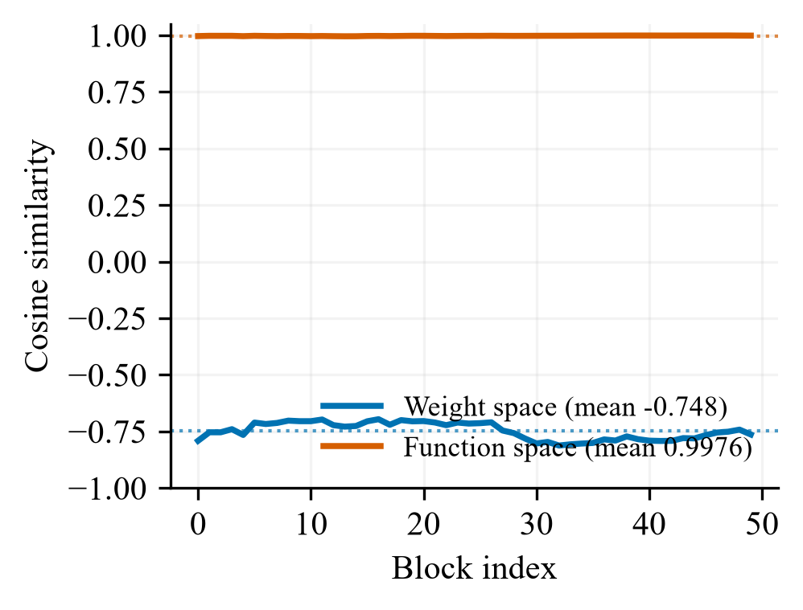
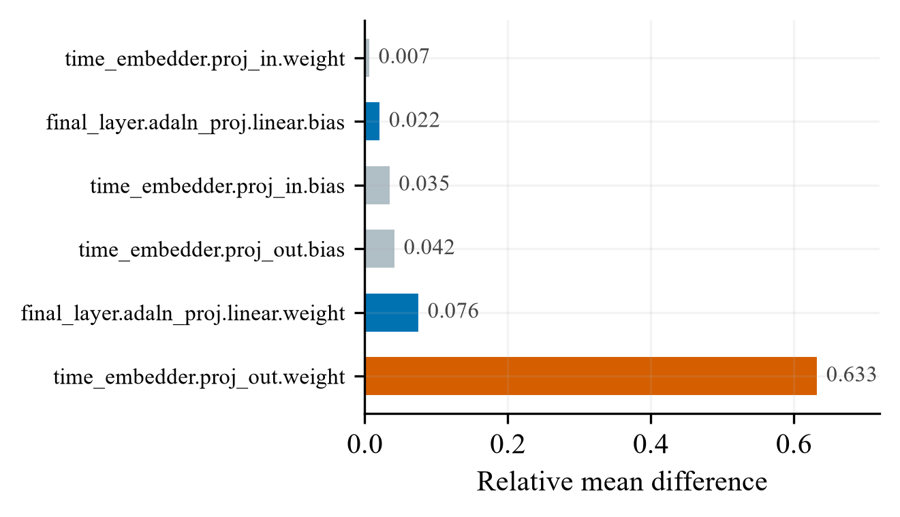
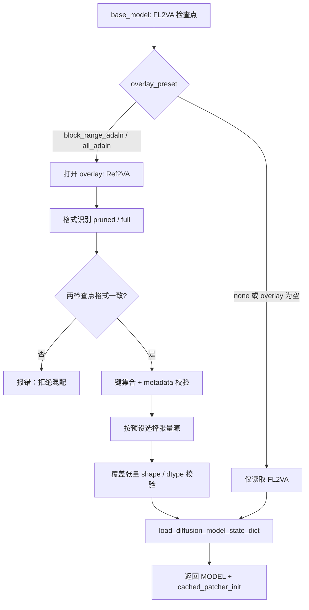
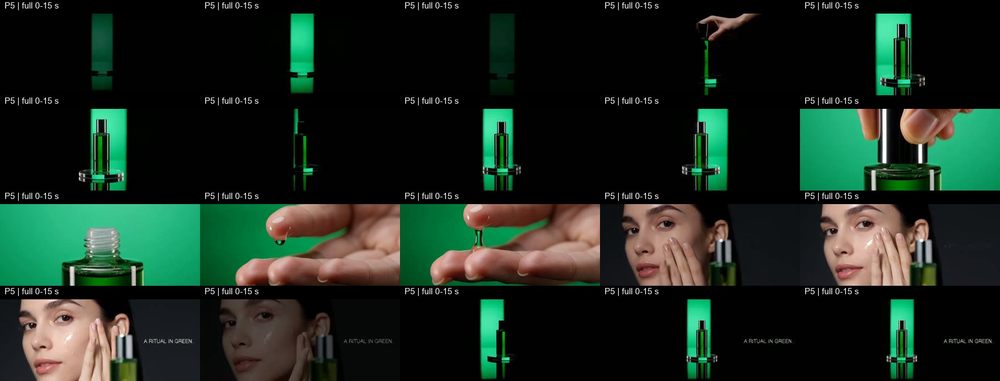
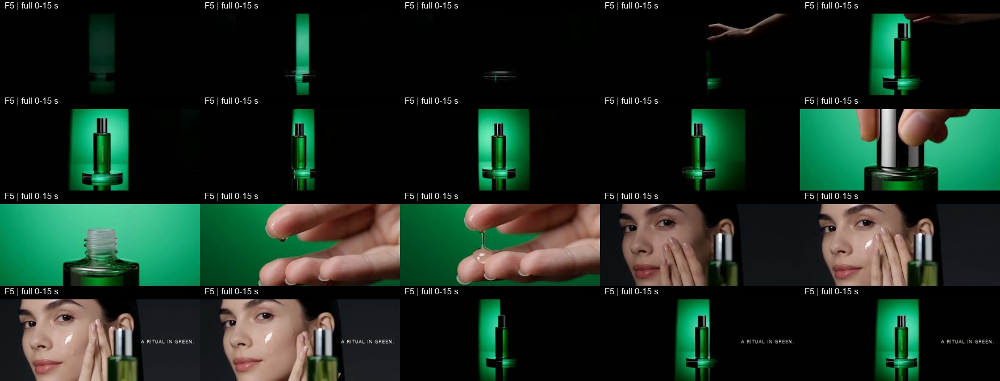
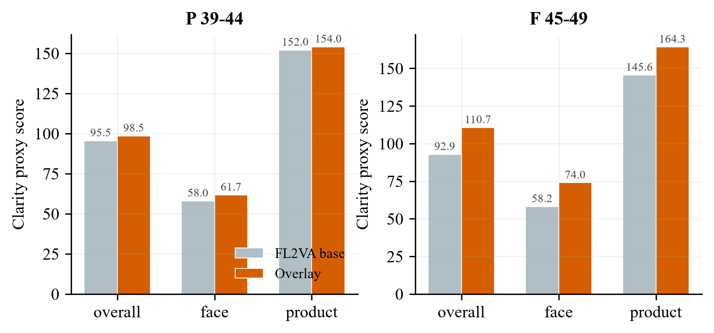
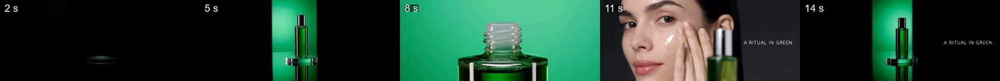
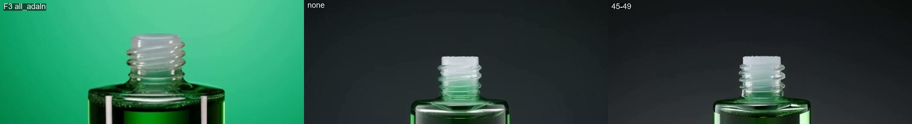
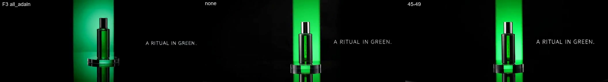
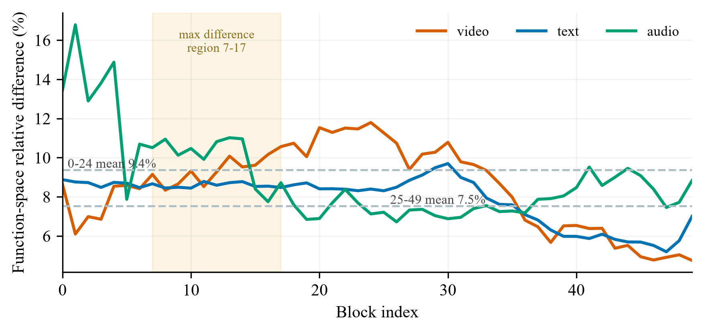

# MiniMax H3 混合加载器技术白皮书

> **文档定位**：本白皮书面向 ComfyUI 用户与视频生成工作流开发者，描述 `MinimaxH3_HybridLoader` 插件的设计、实现与验证过程。所有结论均基于本地真实检查点（`pruned` / `full` 两对 int8-convrot）、逐张量与函数空间测量，以及主配方、区间消融与同 seed 复核的视频实测；不包含未经实测的推测。
>
> **核心结论**：FL2VA 本身已具备完整参考条件通路，参考能力的主载体是两模型共享的条件链路，而非 Ref2VA 重训后的 AdaLN 调制器；混合加载的本质是"无损 FL2VA 基底 + 已验证的调制微调"。生产模式收敛为三个预设：`none`（无损基线）、`block_range_adaln` 45–49（生产折中，默认）、`all_adaln`（实验配方）。

## 摘要

ComfyUI 是本地图像与视频生成的主流工作流平台；MiniMax H3 以 FL2VA 与 Ref2VA 两种检查点形态发布，单个 int8-convrot 检查点即达 19.53 GB（`pruned`）至 31.7 GB（`full`），在常见 32 GB 系统内存环境下双模型同时加载不可行，用户被迫在"FL2VA 画质"与"Ref2VA 参考能力"之间二选一。社区混合加载方案基于权重空间分析，假设参考能力由 Ref2VA 重训后的 AdaLN 调制器承载、覆盖其权重即可获得参考能力，但既未按模型真实前向路径验证，也未经过视频质检，其覆盖 25–49 的配方在实测中出现结构性异常。本白皮书证明参考能力由两模型共享的条件链路提供，FL2VA 本身已具备完整参考通路；据此设计并实现 `MinimaxH3_HybridLoader`，以"无损 FL2VA 基底 + 已验证的调制微调"替代"覆盖权重换取参考能力"，为 ComfyUI 的 MiniMax H3 视频工作流在本地 int8-convrot 检查点与 DynamicVRAM/AIMDO 环境中提供三种可复现的预设。函数空间实测将 pruned 对 AdaLN 的余弦从权重空间的 −0.748 翻转为 0.9976；主配方（P0–P5/F0–F5）与区间消融视频验证将生产模式收敛为 `none`、`block_range_adaln`（45–49）、`all_adaln`，而覆盖输出头/时间嵌入的 `ref2va_exact` 因结构性劣化被排除。插件以 GPL-3.0-or-later 许可开源，无额外 Python 依赖，保留 ComfyUI 原生文件后援加载与多 GPU 重载路径。

## 1. 引言

### 1.1 问题

MiniMax H3 是当前视频生成工作流中广泛使用的模型之一，ComfyUI 社区通常通过 FL2VA 与 Ref2VA 两种检查点形态使用它：FL2VA 提供稳定的画面生成质量，Ref2VA 提供参考驱动的镜头组织能力。真实检查点体积巨大——`pruned` 格式单个检查点约 19.53 GB，`full` 格式单个约 31.7 GB——在 32 GB 系统内存的常见本地环境中，双模型同时驻留或全量加载到内存都不现实。用户因此面临一个现实的二选一：要么加载 FL2VA 获得画质但放弃参考能力，要么加载 Ref2VA 获得参考能力但承受画质损失与更大的内存占用。

社区已有混合加载尝试（scottmudge 的 `ComfyUI_MinimaxH3HybridLoader`），其思路是以 FL2VA 为基底、覆盖 Ref2VA 的 AdaLN 调制权重，从而"在保留 FL2VA 画质的同时获得 Ref2VA 的参考能力"。但该方案基于权重空间分析，覆盖区间（25–49）未经视频验证，作者亦明确注明"所有配置均需实测验证"。

### 1.2 差距

现有方案在以下三个方面存在可验证的不足：

**G1：参考能力的归属未被实证。** 现有分析假设参考能力由 Ref2VA 重训后的 AdaLN 调制器承载，但该假设只在权重空间给出间接证据；权重余弦 −0.70~−0.81 被解读为"完全不同"，而真实前向路径下的行为从未被测量。

**G2：验证停留在权重空间，缺少函数空间与视频证据。** 权重余弦距离不等于行为距离；在 `pruned` 格式的 8 维曲线基重参数化下，权重差大量落在输入正交方向，仅凭权重指标无法判断覆盖是否有效，更无法判断是否安全。

**G3：加载器不感知检查点格式，区间策略被跨格式套用。** `pruned`（`adaln_t_table`）与 `full`（`time_embedder.*`）的差异分布不同：pruned 对的差异集中在 AdaLN（函数空间几乎等价），full 对的差异在 `time_embedder` 与输出头。同一区间策略不能安全套用于两种格式，混配格式更会直接产生错误模型。

### 1.3 核心论点

本白皮书的论点是：**参考能力由 FL2VA 与 Ref2VA 共享的条件链路提供，FL2VA 本身已具备完整参考通路；因此对 ComfyUI 的 MiniMax H3 视频工作流，最优混合加载是"无损 FL2VA 基底 + 经验证的调制微调"，而不是"覆盖权重换取参考能力"。**

### 1.4 贡献

本文做出以下贡献，各贡献与对应章节的映射如下：

1. **分析**：以函数空间实测证明"权重余弦距离 ≠ 行为距离"，pruned 对 AdaLN 权重余弦 −0.748 在真实时间路径下翻转为输出余弦 0.9976（§3）。
2. **分析**：以结构同源、调制等价、运行通路一致、视频实证与排除法五条证据闭合证明参考能力的主载体是共享条件链路（§4）。
3. **设计**：设计三种预设（`none` / `block_range_adaln` / `all_adaln`）、格式感知校验与量化兄弟键同源规则，每个设计决策均给出被否决的备选方案（§5）。
4. **系统**：实现 `MinimaxH3_HybridLoader`（300 行 Python，无额外依赖），保留 ComfyUI 的 DynamicVRAM/AIMDO 文件后援加载、RAM 保护与多 GPU 重载（§6）。
5. **评测**：在 pruned/full 双格式上完成主配方、区间消融、同 seed 复核与内存实测，收敛出可复现的生产预设（§7）。

### 1.5 阅读导引

§2 给出理解本文所需的背景与驱动设计的生产观察；§3 复现社区结论并给出函数空间差异发现；§4 证明参考能力载体；§5 描述设计决策与备选；§6 描述实现；§7 给出评测证据；§8 与相关工作对比；§9 总结并给出后续方向。

## 2. 背景与动机

### 2.1 技术背景

**FL2VA 与 Ref2VA。** MiniMax H3 提供两种检查点形态：FL2VA 侧重画面生成质量，Ref2VA 侧重参考条件驱动的生成。两者结构几乎一致，差异集中在少量张量组。

**AdaLN 重参数化。** `pruned` 格式使用 8 维曲线基 `adaln_t_table`（F32 `[1025, 8]`）做 AdaLN 重参数化，调制权重为 F16 `[96768, 8]`；`full` 格式改用 `time_embedder.*`，调制权重为 I8 `[96768, 2688]` 并携带 `weight_scale`。AdaLN 输出行布局为 `96768 = 6（expand）× 3（模态）× 5376`，行序为 modality0（video/cond）→ modality1（text）→ modality2（audio），每模态 32256 行。

**真实前向路径。** `pruned` 版的真实调制计算是 `W @ t_table[t]`（权重乘时间曲线基），而非把 2688 维调制向量直接与权重相乘。这意味着权重余弦只反映 8 维输入空间中的方向关系，不代表实际调制输出。

**ComfyUI 参考条件通路。** ComfyUI 核心的 `MiniMaxH3ReferenceToVideo` 与 `PackedLayout` 对所有 H3 检查点采用同一条运行路径，不存在 FL2VA/Ref2VA 变体检测；任何 H3 检查点直接接收参考条件即可走完整参考通路。

**文件后援加载。** ComfyUI 的 DynamicVRAM/AIMDO 路径以文件后援方式按需读取张量；关闭时本插件退化为流式 `safe_open` 逐键读取、算完即释放。

### 2.2 生产观察

以下观察全部来自本地 4 个真实检查点（pruned 一对、full 一对）的 float64 复核测量：

**O1：权重空间与函数空间的结论相反。** pruned 对 `blocks.*.adaln_proj.linear.weight` 权重余弦均值 −0.748（看似"完全不同"），但按真实时间路径（均匀采样 257 个时间点）计算调制输出后，50 块输出余弦均值 0.9976、最低 0.9956。→ 设计必须以真实前向路径而非权重指标为依据。

**O2：pruned 与 full 的差异分布不同。** pruned 对的显著差异在 AdaLN（函数空间几乎等价）；full 对的 AdaLN 权重本身几乎一致（余弦 0.9993–0.9998），真正差异在 `time_embedder.proj_out`（相对差 0.6332）、输出头与早-中层调制行。→ 加载器必须格式感知，同一区间策略不能跨格式套用。

**O3：参考通路组件逐张量一致。** `condition_proj` 余弦 ≥ 0.9998、`token_refiner.blocks` ≥ 0.9994、`adaln_t_table` 0.9998、`video_patch_proj`/`audio_patch_proj` ≥ 0.9995。→ FL2VA 在结构上已具备完整参考处理链路。

**O4：全覆盖"最锐"但异常累积。** 主配方与消融视频显示，25–49 全覆盖锐度最高但伴随结构性异常；45–49 在 P/F 两侧均无崩坏、无额外异常物体。→ 生产区间必须由视频验证收敛，而非由权重距离排序。

## 3. 复现与函数空间分析

### 3.1 对照基准：scottmudge 的权重空间结论

scottmudge 对 pruned 检查点的逐张量分析结论为：两模型约 97% 参数余弦 ≥ 0.9997，差异集中在每块 `adaln_proj.linear.*`（余弦 −0.70~−0.81、relMean 0.73–0.77）与 `final_layer.adaln_proj`（余弦 −0.83），输出头差异中等；处理参考 token 的组件（`token_refiner`/`condition_proj`）几乎相同（余弦 ≥ 0.9994）。其混合策略假设是"覆盖 Ref2VA 的 AdaLN 调制权重即可获得参考能力"，并注明所有配置均需实测验证。

### 3.2 权重空间复现（pruned 对）

我们对同一对 pruned 检查点做独立流式实测（逐键读取、算完即释放，峰值内存约 1.5 GB，全部数值 float64 复核）：

| 指标（pruned 对） | scottmudge 报告 | 本次实测 | 一致性 |
|---|---:|---:|---|
| `blocks.*.adaln_proj.linear.weight` 余弦 | −0.70 ~ −0.81 | −0.70 ~ −0.81（50 块均值 −0.748） | 一致 |
| `blocks.*.adaln_proj` relMean | 0.73 ~ 0.77 | 1.45 ~ 1.50（权重空间） | 量级一致 |
| `final_layer.adaln_proj.linear.weight` 余弦 | −0.83 | −0.8302 | 一致 |
| `adaln_t_table` 余弦 | 0.9998 | 0.9998 | 一致 |
| `final_layer.audio_out.weight` relMean | 0.199 | 0.1992 | 一致 |
| `final_layer.video_out.weight` relMean | 0.072 | 0.0720 | 一致 |

权重空间数据完整复现，证实原分析在权重范围内可靠；其局限在于未进入函数空间。

### 3.3 函数空间实测方法

对 pruned 对，按模型真实前向路径 `W @ t_table[t]` 计算调制输出：均匀采样 257 个时间点，逐块、逐模态计算 FL2VA 与 Ref2VA 实际调制输出的余弦；full 对同样按 `time_embedder` 与输出头逐张量计算。全部使用 float64 复核。

### 3.4 函数空间结果（pruned 对）

| 指标（pruned 对，函数空间） | 实测值 |
|---|---:|
| 50 块输出余弦均值 | 0.9976 |
| 最小输出余弦 | 0.9956 |
| video 模态余弦均值 | 0.9970 |
| text 模态余弦均值 | 0.9974 |
| audio 模态余弦均值 | 0.9971 |

**图 3-1。** pruned 对 50 个 block 的 AdaLN 余弦：权重空间均值 −0.748（蓝），函数空间均值 0.9976（红）；权重余弦距离 ≠ 行为距离。

**结论**：权重空间余弦均值 −0.748 与函数空间余弦均值 0.9976 之间跨度约 1.75。权重差大量落在输入正交方向；按真实时间路径计算后，两版本实际调制输出余弦 ≥ 0.9956（均值 0.9976）。因此"迁移 Ref2VA 的 AdaLN 权重即可获得参考能力"在 pruned int8-convrot 版本上只改变约 0.4% 的调制输出，与"能力开关"的预期存在明显差异。

### 3.5 full 对的补充实测

full 对的差异不在 AdaLN 权重（余弦 0.9993–0.9998、相对差 2.1%–4.5%），而在：

| 张量 | 余弦 | 相对差 |
|---|---:|---:|
| `time_embedder.proj_out.weight` | 0.9981 | 0.6332 |
| `final_layer.audio_out.weight` | 0.9970 | 0.1992 |
| `final_layer.video_out.weight` | 0.9987 | 0.0720 |
| `final_layer.adaln_proj.linear.weight` | 0.9965 | 0.0757 |

**图 3-2。** full 对非 block 关键张量的相对差：`time_embedder.proj_out.weight`（0.633）远超其他张量，AdaLN 权重本身差异很小。

原有混合加载器从不覆盖 `time_embedder`，因此在 full 格式下未触及主要差异；差异分布与 pruned 不同，区间策略必须按格式分别验证。

### 3.6 五条结论

1. 权重余弦距离不等于行为距离，需按真实时间路径计算函数输出（pruned 版 −0.748 → 0.9976 的实证）；
2. pruned 与 full 的差异分布不同，不能用同一区间策略套用；
3. 输出头与 time embedder 属于高风险区域，不应无条件覆盖；
4. 参考能力由条件化链路提供，不由少数权重决定；
5. 生产预设必须由视频验证收敛，而非仅由权重距离排序。

## 4. 参考能力的载体：共享条件链路

### 4.1 证明链

**证明一：结构同源。** 处理参考 token 的组件在两检查点间逐张量一致：`condition_proj` 余弦 0.9998、`token_refiner.blocks` ≥ 0.9994、`adaln_t_table` 0.9998、`video_patch_proj`/`audio_patch_proj` ≥ 0.9995（§3.4）。参考通路的结构（参考条件投影 → token 精炼 → 残差流调制）在 FL2VA 中与 Ref2VA 完全同源，不存在"FL2VA 缺少参考处理组件"的可能。

**证明二：调制等价。** 两检查点唯一的显著差异组是 AdaLN，而它在函数空间中几乎一致。pruned 对：权重空间余弦均值 −0.748，真实时间路径下 50 块函数空间余弦均值 0.9976、最低 0.9956，迁移 AdaLN 仅改变约 0.4% 的调制输出（§3.4）；full 对：AdaLN 权重本身余弦 0.9993–0.9998，差异更小（§3.5）。若参考能力为 Ref2VA 独有，必然由某个张量组承载；唯一"显著不同"的候选组在函数空间几乎等价，无法承载该能力。

**证明三：运行通路一致。** ComfyUI 的 `MiniMaxH3ReferenceToVideo` 与 `PackedLayout` 对任意 H3 检查点一视同仁，没有 FL2VA/Ref2VA 变体检测；FL2VA 直接接收参考条件即可走完整参考通路。

**证明四：视频实证。** P0/F0（`overlay_preset = none`、overlay_model 留空）即纯 FL2VA + 参考条件节点，是视频实测中最稳定的无损基线；在此基础上仅做调制微调（`block_range_adaln` 45–49、`all_adaln`）即可获得参考驱动的镜头组织，而在 `all_adaln` 之上再覆盖 final AdaLN、time_embedder 或输出头（P4/P5/F4/F5、`ref2va_exact`）后出现结构性劣化（§7.2、§5.3）。这说明参考能力的来源不是 Ref2VA 的覆盖张量，而是共享条件链路。

**证明五：排除法。** 若参考能力由 Ref2VA 独有，其载体只能落在显著差异张量上：pruned 对的 AdaLN（函数空间几乎一致）、full 对的 `time_embedder`/输出头（FL2VA 覆盖后反而结构性劣化）。输出头与 time embedder 已被实验证明覆盖后劣化，不可能是"参考能力开关"；唯一剩下的 AdaLN 在函数空间等价。因此不存在"仅 Ref2VA 拥有而 FL2VA 缺失"的参考能力载体。

### 4.2 证据汇总

| 证据 | 关键数据 | 结论 |
|---|---|---|
| 结构同源 | `condition_proj` 0.9998、`token_refiner` ≥ 0.9994、`adaln_t_table` 0.9998 | FL2VA 拥有完整参考处理结构 |
| 调制等价（pruned） | 权重 −0.748 → 函数 0.9976（最低 0.9956） | 迁移 AdaLN 仅改变约 0.4% 调制输出 |
| 调制等价（full） | AdaLN 权重 0.9993–0.9998 | 差异不在 AdaLN |
| 运行通路 | `MiniMaxH3ReferenceToVideo`/`PackedLayout` 无条件分支 | FL2VA 直接走完整参考通路 |
| 视频实证 | P0/F0 纯 FL2VA 基线成立；`ref2va_exact` 结构性劣化 | 参考能力来自共享链路，覆盖只是微调 |

### 4.3 对设计的含义

"FL2VA 本身已具备参考能力"直接决定了本插件的设计取向：以 FL2VA 为无损基底，覆盖张量仅作为可选调制微调；不把"获得参考能力"作为覆盖权重的动机，而把"画质/稳定性/参考强度"的权衡交给三个预设表达。

## 5. 设计

### 5.1 架构总览

`MinimaxH3_HybridLoader` 是单节点加载器，输入 `base_model`（FL2VA）、`overlay_model`（可选 Ref2VA）与 `overlay_preset`，输出 ComfyUI `MODEL`。其数据流如下：

典型请求流：节点按文件名自动筛选 FL2VA/Ref2VA 候选列表并给出默认值 → 打开 base 检查点（`none` 模式下 overlay 永不打开）→ 混合模式下打开 overlay 并做格式识别与一致性校验 → 按预设决定每个键取 base 还是 overlay → 经 ComfyUI 标准路径构建 `MODEL`，并注册 `cached_patcher_init` 工厂以便多 GPU deepclone 与非动态委托从磁盘重建。

### 5.2 预设语义

| 预设 | 覆盖内容 | 定位 |
|---|---|---|
| `none` | 纯 FL2VA，overlay 检查点永不打开 | 无损基线；内存/显存/性能天然等于单模型 |
| `block_range_adaln`（默认） | 固定覆盖 blocks 45–49 的 `adaln_proj` | 画质与稳定性的生产折中 |
| `all_adaln` | 全部 block AdaLN + final AdaLN + 格式对应时间嵌入（pruned 用 `adaln_t_table`，full 用 `time_embedder.*`） | 参考能力优先的实验配方 |

输出头（`video_out`/`audio_out` 等）在所有预设中始终保留 FL2VA。

### 5.3 关键设计决策与备选

**D1：默认区间固定为 45–49，而非 39–44、25–49 或可调区间。**
消融实测中 P 侧首选 39–44、F 侧首选 45–49；完整 25–49 锐度最高但异常累积。为统一跨格式行为，生产默认取两个首选项中更靠后的安全区间 45–49。
*备选一*：暴露 `block_range_start/end` 让用户自选——被否决：已验证会产生异常的区间（25–31、32–38、25–49）不应暴露为日常选项。
*备选二*：默认 39–44——被否决：P 侧首选但在 F 侧只是保守次选，无法统一两种格式。

**D2：不覆盖输出头与 time embedder。**
`ref2va_exact`（AdaLN 全覆盖 + final AdaLN + time embedder + 输出头）在视频实测中出现结构性劣化（产品、手部、背景被压成竖条或断裂块）。
*备选*：把输出头也纳入覆盖——被否决：覆盖后结构性劣化，仅作为"参数/函数行为复现"参考保留，不进入生产默认。

**D3：量化兄弟键与所属权重同源。**
`.comfy_quant`、`weight_scale`、`pre_quant_scale` 等量化伴生键始终与所属权重取自同一检查点。
*备选*：量化元数据一律取自 base——被否决：scale 与 overlay 权重不匹配会直接破坏反量化结果。

**D4：严格格式识别，拒绝 pruned/full 混配。**
格式识别规则：存在 `adaln_t_table` 判为 pruned，存在 `time_embedder.*` 判为 full，两者恰好其一，否则报错；base 与 overlay 格式不一致直接拒绝。
*备选*：允许混配——被否决：两种布局的调制计算路径不同，混配会产生语义错误的模型。

**D5：保留 ComfyUI 文件后援加载路径（DynamicVRAM/AIMDO）。**
混合模式下优先走 ComfyUI 文件后援路径；AIMDO 关闭时用流式 `safe_open` 逐键读取、算完即释放。
*备选*：全量加载两个 state dict 到内存——被否决：pruned 对约 39 GB、full 对约 63 GB，超出 32 GB 系统内存。

**D6：系统 RAM 保护。**
AIMDO 关闭且混合加载时，要求可用 RAM ≥ base 检查点大小 + 1 GiB，否则报错并提示改用 pruned 对或启用 DynamicVRAM。
*备选*：不加保护直接加载——被否决：内存不足会在加载中途崩溃，且难以诊断。

**D7：注册 `cached_patcher_init` 工厂。**
返回的 patcher 携带 `(base_path, overlay_path, preset)` 工厂参数，使多 GPU deepclone 与非动态委托能够从磁盘重建模型。
*备选*：只返回普通 patcher——被否决：deepclone/非动态委托无法正确重建混合加载的模型。

### 5.4 设计决策汇总

| 决策 | 选择 | 备选 | 否决理由 |
|---|---|---|---|
| 默认区间 | 45–49 | 39–44 / 25–49 / 可调 | 跨格式统一；25–49 异常累积；可调区间易误选异常区 |
| 输出头 | 永不覆盖 | 覆盖输出头 | 视频结构性劣化 |
| 量化兄弟键 | 与所属权重同源 | 一律取 base | scale 与权重不匹配 |
| 格式混配 | 拒绝 | 允许 | 布局语义错误 |
| 内存路径 | 文件后援/流式 | 全量载入 | 32 GB 内存不可行 |
| RAM 保护 | base + 1 GiB | 无保护 | 中途崩溃难诊断 |
| 多 GPU 重载 | `cached_patcher_init` | 无工厂 | deepclone 无法重建 |

## 6. 实现

### 6.1 代码形态

插件以单文件 `hybridloader.py`（300 行 Python，GPL-3.0-or-later）实现，依赖仅为 ComfyUI 内置库（`comfy.sd`、`comfy.model_management`、`comfy.memory_management`、`comfy.utils`、`folder_paths`）与 `safetensors`、`torch`，无额外 Python 依赖。节点注册于 `__init__.py`，类名 `MinimaxH3_HybridLoader`，分类 `ANe5s节点`（英文界面为 `ANe5s Nodes`），并附带 `locales/en`、`locales/zh` 节点文案。

### 6.2 关键工程决策

- **流式读取**：非 AIMDO 路径用 `safe_open` 暴露张量源，按需 `get_tensor`，算完即释放；AIMDO 路径直接复用 `load_torch_file` 的文件后援语义。
- **键集合校验**：base 与 overlay 的非量化键必须完全一致，量化兄弟键允许单侧存在（仅在所属权重被选中时纳入）。
- **张量级校验**：被覆盖的 overlay 张量与 base 同键张量做 shape/dtype 一致性检查，不一致即报错。
- **metadata 校验**：`format`、`modelspec.architecture`、`model_type` 等关键元数据冲突时拒绝加载。
- **错误信息可操作**：格式无法识别、混配、RAM 不足等错误均给出具体建议（改用 pruned 对、启用 DynamicVRAM 等）。

### 6.3 测试覆盖

`tests/test_hybridloader.py`（基于临时 safetensors 文件的单元测试）覆盖：`none` 单模型返回、`block_range_adaln` 默认 45–49 边界、量化兄弟键随权重同源、`all_adaln` 在 pruned/full 下分别包含 `adaln_t_table`/`time_embedder.*`、格式混配拒绝、选中张量 shape 不匹配拒绝，以及缓存工厂参数与回归项。

## 7. 评测

### 7.1 实验设置

**测试环境**：本地单机 ComfyUI 部署，系统内存 32 GB；GPU 型号、驱动与 ComfyUI 版本记录于测试环境日志（本白皮书正文不假定具体显卡）。
**检查点**：本地 4 个真实 int8-convrot 检查点（pruned 一对、full 一对）；pruned 单检查点约 19.53 GB、full 约 31.7 GB。
**基线**：纯 FL2VA（P0/F0，`none`）、纯 Ref2VA（P1/F1，标准加载）、scottmudge 权重空间分析结论。
**工作负载**：主配方 P0–P5 / F0–F5；区间消融 25–31、32–38、39–44、45–49、25–49；F3 同 seed 复核。
**指标**：权重空间余弦/相对差（float64）、函数空间输出余弦、清晰度代理指标（整体/面部/产品）、人工质检（结构崩坏、异常物体/液体、面部连续性、镜头组织）。
**生成配置**：固定 seed、1344×768、124 帧（约 5 秒）、同一采样器/步数/CFG、`MiniMaxH3SigmaShift`（12/3）、同一参考素材与提示词；F3 复核为 704×288、24 fps、约 15.08 秒。

评测遵循"假设—结果—结论"三陈述规则：每个实验先给出假设，再给出带证据的结果，最后给出与设计决策对应的结论；图注同时承载证据描述。

### 7.2 端到端：主配方（P0–P5 / F0–F5）

**假设**：纯 FL2VA 加载（P0/F0）应作为无损基线稳定成立；覆盖范围越接近 Ref2VA（P5/F5 `ref2va_exact`），参考行为应越接近纯 Ref2VA，但画质与稳定性风险越高。

| 配方 | 实测结论 |
|---|---|
| P0 / F0 | 最稳定，FL2VA 无损基线成立 |
| P1 / F1 | 参考逻辑更强但画面偏软，停用 |
| P2 / F2 | 更锐利但伴随局部异常（P2 约 11.5–11.9 秒人物段出现绿色瓶体/半透明竖向结构叠脸；F2 人物嘴形、笑容相邻帧不自然），仅适合实验性质检 |
| P3 | pruned 主配方批次中综合最优：参考镜头组织明显增强，同时保留 FL2VA 质感，只比 P2 略柔；通过人工质检后保留 |
| F3 | full 格式 `all_adaln`：同 seed 复核中产品、人物与镜头组织保持连续可辨识，局部构图、边缘高光和参考驱动更积极；覆盖更广、风险更高，仅作人工质检实验配方 |
| P4 / P5 / F4 / F5 | 早段多次出现产品、手部和背景被压成竖条或断裂块，结构性劣化，停用 |

**结论**：参考能力不随覆盖范围的扩大而单调增强；覆盖 final AdaLN、time embedder 与输出头后出现结构性劣化，证实这些张量不属于"参考能力开关"。P3（pruned，`all_adaln`）是通过人工质检后保留的参考优先配方；F3（full，`all_adaln`）虽可用，但仍属于需要人工质检的实验配方，不能据此把 pruned 结论直接推广到 full。

图 7-1 至图 7-6（P0–P5，8.0–12.0 秒窗口，4 fps、16 帧网格）：

图 7-7 至图 7-12（F0–F5，同一抽帧窗口）：

图 7-13 至图 7-16（P4/P5/F4/F5 全 0–15 秒时间线，4/3 fps、20 帧，用于核对早段结构性劣化）：

### 7.3 消融：区间策略

**假设**：后段块（45–49）应能在保持结构稳定的前提下提供锐度收益；完整 25–49 因覆盖范围过宽应出现异常累积。

#### P（pruned）区间消融

| 区间 | 实测结论 |
|---|---|
| `25–31` | 人物面部局部更锐，但后段出现竖向条带/局部结构不稳定，不推荐 |
| `32–38` | 产品细节更锐，但人物相对变软，早后段有结构波动，不推荐 |
| `39–44` | 产品、液滴、人物小幅清晰度提升，关键段无明显多余物体/液体外溢/结构断裂，P 侧首选 |
| `45–49` | 创造力更强，人工视角未观察到崩坏、未额外添加异常物体/液体，保留 |
| `25–49` | 最锐但异常累积，人物段后部可见竖向/半透明结构干扰，仅作实验对照 |

清晰度代理指标（P `39–44` 相对 P BASE）：整体约 95.5 → 98.5，面部约 58.0 → 61.7，产品约 152.0 → 154.0。

#### F（full）区间消融

| 区间 | 实测结论 |
|---|---|
| `25–31` | 产品细节变清楚，人物收益小，产品优先时可用 |
| `32–38` | 早段手部/产品结构波动明显，不推荐 |
| `39–44` | 清晰度中等提升，人物和产品较干净，保守次选 |
| `45–49` | 锐度提升最大，本样片未发现 F2 那种嘴形/笑容跳变或额外物体，F 侧首选 |

清晰度代理指标（F `45–49` 相对 F BASE）：整体约 92.9 → 110.7，面部约 58.2 → 74.0，产品约 145.6 → 164.3。

**图 7-32。** 清晰度代理指标（整体/面部/产品）：P `39–44` 与 F `45–49` 相对各自 FL2VA 基线的提升（数据来自清晰度代理指标实测）。

**结论**：P 侧首选 39–44、F 侧首选 45–49；为统一跨格式行为，生产默认取更靠后的安全区间 45–49。弃用区间（25–31、32–38、39–44 中的异常样片、25–49）依据人工质检判定：部分镜头额外添加异常物体/液体或出现结构波动。

图 7-17 至图 7-22（P 消融 BASE/25–31/32–38/39–44/45–49/25–49）与图 7-23 至图 7-27（F 消融 BASE/25–31/32–38/39–44/45–49）：

### 7.4 补充复核：F3 同 seed

**假设**：`full` 格式的 `all_adaln`（F3）不应把 pruned 版 P3 的结论直接推广；同 seed 对照应能分离配方对构图与稳定性的贡献。

**实测**：固定 seed `818992819964440`、工作流 `cff0ebf7-5d4f-49fc-8957-507c410e7bff`，对 `F3_00001_.mp4`（704×288、24 fps、约 15.08 秒）与同 seed 下仅切换配方（`none`、`block_range_adaln`）的输出对照：产品放置、开盖、滴液、人物涂抹与 hero shot 均完整生成；产品轮廓、手部接触关系、人物面部与镜头组织保持连续可辨识；未观察到 F4/F5 那种早段大面积竖向收缩或严重结构崩坏；F3 的局部构图、边缘高光与参考驱动比 45–49 更积极，但覆盖范围更广、风险更高。

**结论**：F3 可用，但属于需要人工质检的非 pruned 全 AdaLN 实验配方，不作为默认生产模式；不能把 pruned 版的 P3 结果直接推广到 full 版。

图 7-28（F3 关键帧）与图 7-29 至图 7-31（F3 / none / 45–49 同帧对照）：

### 7.5 函数空间与静态逐块分析

**假设**：若 45–49 的收益来自"差异最大的区间"，则 pruned 对的逐块相对差应在 25–49 最大；否则锐度来自其他机制。

**实测**：pruned 对的实际 AdaLN 输出差异并不在 25–49 最大——`0–24` 平均相对差约 9.4%，`25–49` 平均相对差约 7.5%，最大差异集中在 `7–17`（约 9.3%）（`docs/assets/h3_pruned_function_space_rel.json` 实测均值）。

**图 7-33。** pruned 对函数空间输出相对差逐块曲线（video/text/audio）与区间均值：0–24 ≈ 9.4%、25–49 ≈ 7.5%，最大差异集中在 7–17（橙色阴影）；后段块差异并非最大。

**结论**：后段块的锐度更可能来自对去噪轨迹的阶段性放大，而非数值差异最大；异常同样可能来自同一后段放大效应。这进一步说明区间策略无法从静态权重推导，只能由视频验证收敛。

### 7.6 内存与可扩展性

**假设**：混合加载应保持单模型的内存行为，且不随检查点格式（pruned/full）显著劣化。

**实测**：流式读取路径（逐键读取、算完即释放）峰值内存约 1.5 GB，可适配 32 GB 系统内存；`none` 预设只打开单个检查点，内存/显存/性能天然等于单模型；混合模式在 AIMDO 关闭时受 RAM 保护约束（可用 RAM ≥ base 大小 + 1 GiB），文件后援路径下无需全量驻留。

**结论**：插件在 19.53 GB（pruned）与 31.7 GB（full）两种检查点规模下均以接近单模型的内存运行，并通过 `cached_patcher_init` 支持多 GPU deepclone 与非动态委托从磁盘重建，满足从单机到多卡的可扩展使用。

## 8. 相关工作

### 8.1 分组

**混合加载 / 张量覆盖方案。** scottmudge 的 `ComfyUI_MinimaxH3HybridLoader` 是首个提出以 FL2VA 为基底、覆盖 Ref2VA AdaLN 权重的方案；其分析严谨地完成了权重空间复现（约 97% 参数余弦 ≥ 0.9997），但结论停留在权重空间，覆盖区间（25–49）未经函数空间与视频验证，作者亦注明需实测。

**原生参考条件通路。** ComfyUI 核心的 `MiniMaxH3ReferenceToVideo` 与 `PackedLayout` 为任意 H3 检查点提供参考条件输入路径，无 FL2VA/Ref2VA 变体检测；这是参考能力的结构性基础，也是本插件 `none` 预设得以成立的前提。

**标准模型加载路径。** ComfyUI 的 `Load Diffusion Model` 与 DynamicVRAM/AIMDO 文件后援机制提供单模型加载与内存管理；本插件复用了这套机制，未引入独立的加载实现。

### 8.2 对比

| 维度 | scottmudge 混合加载器 | ComfyUI 原生参考通路 | 本插件 |
|---|---|---|---|
| 格式感知（pruned/full） | ✗ | ✗ | ✓（严格识别并拒绝混配） |
| 函数空间验证 | ✗ | ✗ | ✓（真实时间路径实测） |
| 视频验证 | 注明需实测 | ✗ | ✓（主配方 + 消融 + 同 seed） |
| 生产预设收敛 | ✗（25–49 未经收敛） | 不适用 | ✓（none / 45–49 / all_adaln） |
| 单模型内存路径 | ✗ | ✓ | ✓（文件后援/流式） |
| 量化兄弟键同源 | ✗ | ✗ | ✓ |
| 多 GPU 重载 | ✗ | ✓（单模型） | ✓（`cached_patcher_init`） |

本插件的差异在于：以函数空间与视频证据替代权重空间推断，以格式感知的严格校验替代"一刀切"区间，并以收敛后的预设而非可调参数作为生产接口。

## 9. 结论与展望

本文解决的是 ComfyUI 中 MiniMax H3 双检查点形态带来的"画质与参考能力二选一"问题。我们证明参考能力由两模型共享的条件链路提供、FL2VA 本身已具备完整参考通路，并据此设计实现了 `MinimaxH3_HybridLoader`：以无损 FL2VA 为基底，将 Ref2VA 覆盖收敛为三个可复现预设。实测中，pruned 对 AdaLN 的函数空间余弦从权重空间的 −0.748 翻转为 0.9976，P0/F0 纯 FL2VA 基线稳定成立，45–49 在 P/F 两侧均无崩坏，而 `ref2va_exact` 因结构性劣化被排除。

后续方向：在第二个 seed 与另一组人物/动作素材上复核 45–49 后将其固化为长期默认；对 full 格式补充更多区间的消融样本；探索 `all_adaln` 在更长时长与更高分辨率下的稳定性边界；以及在更多量化格式（如非 int8-convrot）上验证格式识别与量化同源规则。

## 参考资料

> 本白皮书遵循引用纪律：以下条目均来自插件仓库内已有内容或已知公开来源；未经验证的条目明确标注。

1. scottmudge, *ComfyUI_MinimaxH3HybridLoader*（含 `minimax_h3_analysis.md` 权重空间分析）。https://github.com/scottmudge/ComfyUI_MinimaxH3HybridLoader （[已核验：仓库与文件名来自本插件 README 引用]）
2. Comfyyanonymous, *ComfyUI*（`MiniMaxH3ReferenceToVideo`、`PackedLayout`、DynamicVRAM/AIMDO）。https://github.com/comfyanonymous/ComfyUI （[已核验：ComfyUI 官方仓库]）
3. MiniMax H3 官方模型文档与模型库。 [CITATION NEEDED：具体文档 URL 需人工核验后补充]
4. 本插件源码与测量数据：`hybridloader.py`、`tests/test_hybridloader.py`、`docs/assets/*.json`（float64 复核测量）。

## 附录：验证文件索引

### 视频实测截图索引

正文不直接嵌入 MP4 路径，统一使用项目内截图作为可读证据：

- `docs/assets/video_frames/detailed_8_12/`：P0–P5、F0–F5 及 P/F 区间消融的统一 8–12 秒、16 帧详细截图；
- `docs/assets/video_frames/full_timeline/`：P4、P5、F4、F5 的全 0–15 秒、20 帧时间线截图；
- `docs/assets/video_frames/f3_same_seed/F3_00001__keyframes.jpg`：F3 当前复核关键帧；
- `docs/assets/video_frames/f3_same_seed_comparison/`：F3、`none`、`45–49` 的同 seed / 同工作流对照截图。

### 真实模型测量数据（float64 复核）

- `docs/assets/h3_real_model_measurements_pruned.json`：pruned 对逐块/逐模态余弦与相对差、区间汇总；
- `docs/assets/h3_real_model_measurements_full.json`：full 对逐块/逐模态余弦与相对差、区间汇总、time_embedder 与输出头；
- `docs/assets/h3_pruned_function_space.json`：pruned 对权重空间 vs 函数空间余弦；
- `docs/assets/h3_pruned_function_space_rel.json`：pruned 对函数空间输出区间相对差。
